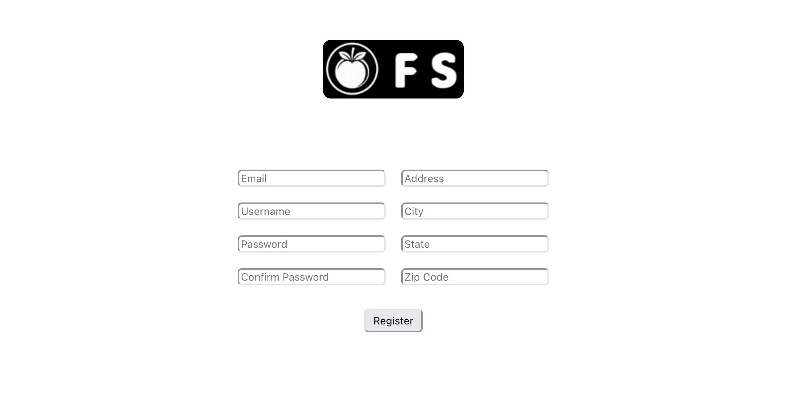
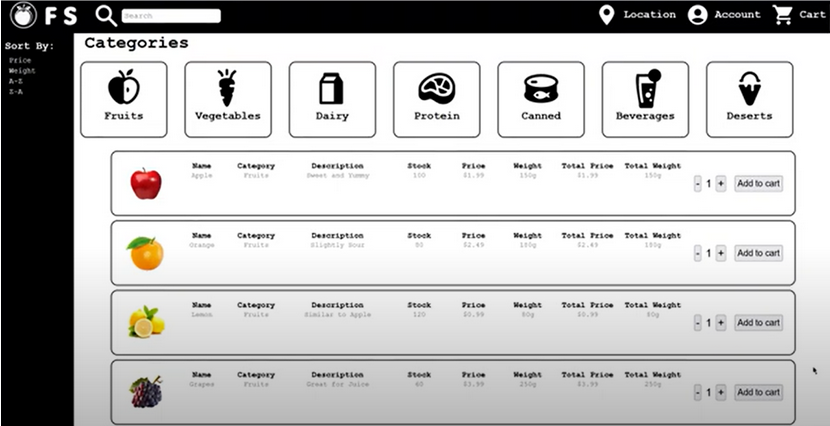
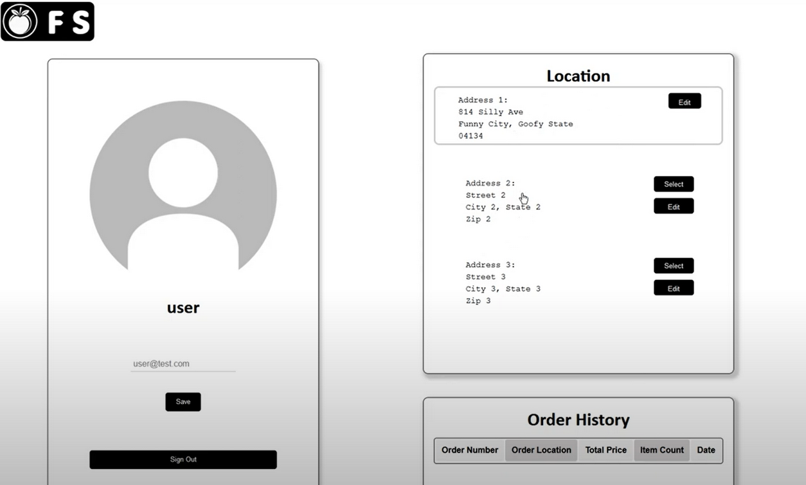
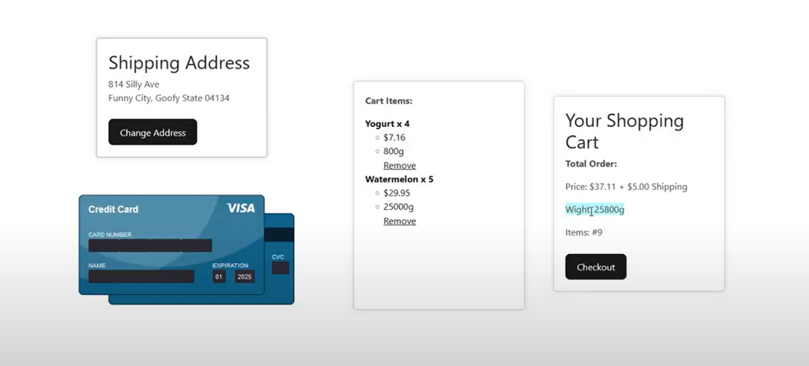
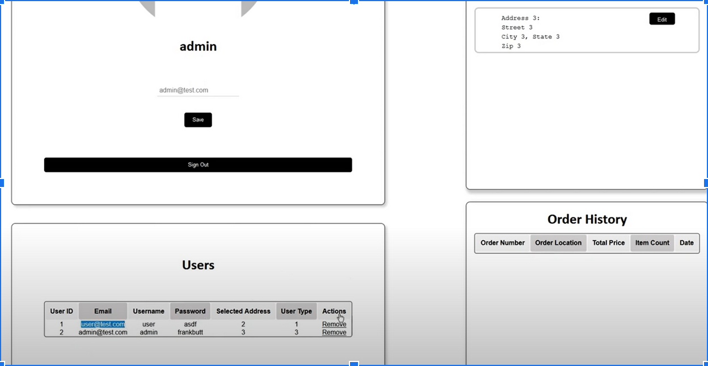
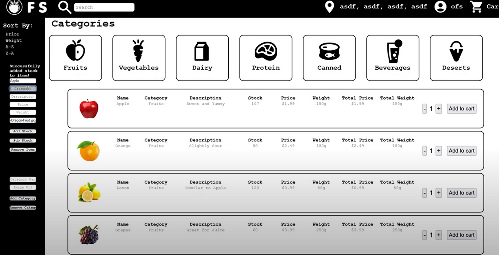

# Online Food Store

## Table of contents

1. Login & Registration
2. Main Page
3. Account Page
4. Cart
5. Admin Account
6. Employee Account

   
## Login & Registration

#### To open an account, one would simply do the generic email, username, street address, and password to complete the registration.

> [!NOTE]
>  Under these modules, the system would also check for repeated email addresses, and would send out a warning that an account had been registered with the email address.

### Once you have created an account, you get a login button that prompts you to the login page. 

## Main Page 

#### The webpage will be broken down into a couple sections. On the very top, there is the navigation bar, which houses our search bar, location, account, and cart. Right below is where our category section is located. Here, the customers can find all the categories they would need in order to proceed with their purchases. The location of the category is decided as it is an easy navigation for users of all ages.  Fruits, Vegetables, Dairy, Protein, Canned, Beverage, and Deserts are the main categories, and once the user clicks on their desired category, they will find all the products listed right below it, which takes the center bit of our web page design. As shown in the attached screenshot down below, all the products are listed vertically, while their information is listed horizontally. This yields an easy to visualize result, and people would not spend too much time navigating, which increases the productivity of individuals. We understand, from a user's perspective, that no one wants to spend a long time navigating through a grocery website, which is why we have implemented all the descriptions on the main page, instead of having them open up another page just to have something added to their carts. This is the same with all the other categories. One major function that we have is that we have a “sort” function which allows the user to sort their products based on weight, price, and order of the alphabet. 

## Account Page

#### If you were to click on the account icon, the system would take the user to a separate account page which shows the user’s name, location, and order history, which is shown in the picture below. The addresses could also be edited and changed, and the changed address would be shown on the main page as well. These are all saved in the database. 

## Cart

#### As we go through the process of food ordering, one could adjust the quantity of the products they want to purchase in the mainpage before adding to cart, and they could also do multiple “add to cart”, which would serve the same purpose. Once the user is done with their shopping, they would need to click the cart button to take them to the cart page, which is where they will find three sections of their information all listed on the same page, without having to scroll up and down.

#### In the center of the page is where we can find the cart items. Here, there is an option to remove the times needed. If the card information is invalid, the user would not be able to proceed with the orders. The weight is also going to be counted as a factor of the delivery pricing, as once reached 20 pounds, there will be a surplus in the shipping cost of 5 dollars. 

> [!NOTE]
> If you need to access your order history or any receipts, they will be in the account page under 'Order History'

## Admin Account 

### Admin accounts can be created by using a secret passcode in the account registration page. When typed in “frankbutt” as the password, an admin account is automatically generated. The main page of the admin account would look exactly the same as it would on an user webpage, but when clicked in the account, the admin would have full access to all the users that are registered and their order history. User type is also shown as 1 being the regular user, 2 being a storefront employee, and 3 being admin. The option to remove the user is also there too. 

## Employee Account

### An employee account follows the same concept, only this time, the secret password is going to be “ofstore”, and this would allow the system to generate an employee account. As shown in the picture below, the employee account has an added functionality which is shown in the very left column. This functionality allows the employee to add, delete, increase, decrease and change the weight of any products. This again is very straightforward to produce. The employee could also add a category to the list, in case the store increase their scope of services. 

